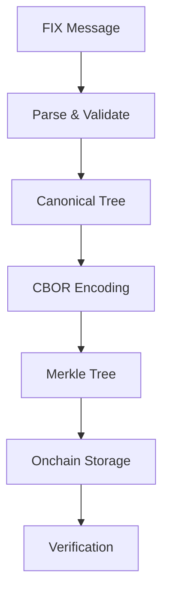

# FixDescriptorKit

> **Transform FIX asset descriptors into verifiable onchain commitments**

A comprehensive toolkit for converting FIX (Financial Information eXchange) protocol asset descriptors into canonical CBOR payloads and Merkle commitments for blockchain verification.

[](https://opensource.org/licenses/ISC)
[](https://www.typescriptlang.org/)
[](https://nextjs.org/)
[](https://getfoundry.sh/)

## 🚀 Features

- **📋 FIX Message Parsing** - Robust parsing of FIX protocol asset descriptors
- **🔗 Canonical CBOR Encoding** - Deterministic CBOR serialization for consistent hashing
- **🌳 Merkle Tree Generation** - Efficient tree construction with cryptographic proofs
- **⛓️ Onchain Verification** - Smart contracts for decentralized proof verification
- **🌐 Web Interface** - Interactive UI for testing and deployment
- **🔐 Wallet Integration** - MetaMask support for blockchain interactions

## 📁 Project Structure

```
fixdescriptorkit-evm/
├── packages/
│   └── fixdescriptorkit-typescript/    # Core TypeScript library
├── apps/
│   └── web/                            # Next.js web application
├── contracts/                          # Solidity smart contracts
├── SPEC.md                            # Technical specification
└── DEPLOYMENT.md                      # Deployment guide
```

## 🛠️ Technology Stack

### **Core Library**
- **TypeScript** - Type-safe development
- **fixparser** - FIX protocol message parsing
- **cbor-x** - Canonical CBOR encoding/decoding
- **viem** - Ethereum blockchain interactions
- **vitest** - Fast unit testing

### **Web Application**
- **Next.js 15** - Full-stack React framework
- **App Router** - Modern routing and serverless functions
- **Tailwind CSS** - Utility-first styling
- **MetaMask** - Web3 wallet integration

### **Smart Contracts**
- **Solidity** - Smart contract development
- **Foundry** - Ethereum development framework
- **OpenZeppelin** - Security-audited contract libraries

## 🏃 Quick Start

### Prerequisites

- Node.js 18+ and npm
- [Foundry](https://getfoundry.sh/) for smart contract development
- MetaMask browser extension

### Installation

```bash
# Clone the repository (with submodules for OpenZeppelin)
git clone --recurse-submodules https://github.com/your-username/fixdescriptorkit-evm.git
cd fixdescriptorkit-evm

# If you already cloned without submodules, run:
# git submodule update --init --recursive

# Install dependencies
npm install

# Build the TypeScript library
npm run build

# Start the development server
npm run dev
```

Visit [http://localhost:3000](http://localhost:3000) to see the application.

## 📖 Usage Examples

### TypeScript Library

```typescript
import { 
  parseFixDescriptor, 
  buildCanonicalTree, 
  encodeCanonicalCBOR,
  enumerateLeaves,
  computeRoot,
  generateProof 
} from 'fixdescriptorkit-typescript';

// Parse FIX message
const fixMessage = "8=FIX.4.4|9=0000|35=d|55=ACME|48=US000000AA11|167=CORP|15=USD|10=000";
const tree = parseFixDescriptor(fixMessage);

// Generate canonical CBOR
const canonical = buildCanonicalTree(tree);
const cbor = encodeCanonicalCBOR(canonical);

// Create Merkle commitment
const leaves = enumerateLeaves(canonical);
const root = computeRoot(leaves);

// Generate proof for specific field (e.g., Currency field at path [15])
const proof = generateProof(leaves, [15]);
console.log('Merkle Root:', root);
console.log('Proof:', proof);
```

### Smart Contract Integration

**Easy Integration with FixDescriptorLib**: Add FIX descriptor support to any token in just 3 steps using the library pattern.

```solidity
import "@openzeppelin/contracts/token/ERC20/ERC20.sol";
import "@openzeppelin/contracts/access/Ownable.sol";
import "./IFixDescriptor.sol";
import "./FixDescriptorLib.sol";

contract MyBondToken is ERC20, Ownable, IFixDescriptor {
    using FixDescriptorLib for FixDescriptorLib.Storage;
    
    // Step 1: Add storage slot
    FixDescriptorLib.Storage private _fixDescriptor;
    
    constructor() ERC20("MyBond", "BOND") Ownable(msg.sender) {}
    
    // Step 2: Add setter with your access control
    function setFixDescriptor(FixDescriptor calldata descriptor) external onlyOwner {
        _fixDescriptor.setDescriptor(descriptor);
    }
    
    // Step 3: Forward IFixDescriptor calls to library
    function getFixDescriptor() external view returns (FixDescriptor memory) {
        return _fixDescriptor.getDescriptor();
    }
    
    function getFixRoot() external view returns (bytes32) {
        return _fixDescriptor.getRoot();
    }
    
    function verifyField(
        bytes calldata pathCBOR,
        bytes calldata value,
        bytes32[] calldata proof,
        bool[] calldata directions
    ) external view returns (bool) {
        return _fixDescriptor.verifyFieldProof(pathCBOR, value, proof, directions);
    }
    
    function getHumanReadableDescriptor() external view returns (string memory) {
        return _fixDescriptor.getHumanReadable();
    }
}
```

**Works with Upgradeable Contracts Too!**

```solidity
import "./FixDescriptorLib.sol";

contract MyUpgradeableBond is 
    ERC20Upgradeable, 
    OwnableUpgradeable, 
    UUPSUpgradeable,
    IFixDescriptor 
{
    using FixDescriptorLib for FixDescriptorLib.Storage;
    FixDescriptorLib.Storage private _fixDescriptor;
    
    function initialize() public initializer {
        __ERC20_init("MyBond", "BOND");
        __Ownable_init(msg.sender);
        __UUPSUpgradeable_init();
    }
    
    // ... same forwarding functions
    
    uint256[49] private __gap; // Reserve storage for upgrades
}
```

**Benefits:**
- ✅ **Easy Integration** - Just 3 steps, ~10 lines of code
- ✅ **Works Everywhere** - Any token standard, any upgrade pattern
- ✅ **No Central Registry** - Fully decentralized, embedded in asset contracts
- ✅ **All Logic Included** - SSTORE2, Merkle proofs, CBOR parsing handled by library
- ✅ **Flexible Access Control** - Use Ownable, AccessControl, or custom logic

**📖 [Complete Integration Guide](./contracts/docs/INTEGRATION_GUIDE.md)**

## 🧪 Testing

### Run Library Tests
```bash
# Set your FIXParser license key
export FIXPARSER_LICENSE_KEY="your-license-key"

# Run tests
npm test
```

If tests reference OpenZeppelin contracts, ensure submodules are initialized:

```bash
git submodule update --init --recursive
```

### Run Contract Tests
```bash
cd contracts
forge test
```

## 🚀 Deployment

### Deploy Smart Contracts

```bash
cd contracts

# Deploy asset token contracts
forge script script/DeployAssetToken.s.sol --rpc-url https://ethereum-sepolia-rpc.publicnode.com --broadcast --verify

# Or deploy your own custom asset contract implementing IFixDescriptor
```

### Deploy Web Application

See [DEPLOYMENT.md](./DEPLOYMENT.md) for detailed Vercel deployment instructions.

### CI (GitHub Actions) Submodules

If you use GitHub Actions, enable submodule checkout:

```yaml
- uses: actions/checkout@v4
  with:
    submodules: recursive
```

## 🏗️ Architecture

### Data Flow



### Core Components

1. **Parser** - Converts FIX messages to structured trees
2. **Canonicalizer** - Normalizes data for deterministic encoding
3. **CBOR Encoder** - Creates compact binary representations
4. **Merkle Engine** - Generates cryptographic commitments and proofs
5. **Asset Contracts** - ERC20/ERC721 tokens with embedded descriptors
6. **Verification Library** - Onchain Merkle proof verification

## 📋 API Reference

### Core Functions

#### `parseFixDescriptor(fixRaw: string): DescriptorTree`
Parses a FIX message string into a structured descriptor tree.

#### `buildCanonicalTree(tree: DescriptorTree): CanonicalNode`
Converts a descriptor tree into canonical form for consistent encoding.

#### `encodeCanonicalCBOR(node: CanonicalNode): Uint8Array`
Encodes canonical data into deterministic CBOR format.

#### `computeRoot(leaves: MerkleLeaf[]): string`
Computes the Merkle root hash from enumerated leaves.

#### `generateProof(leaves: MerkleLeaf[], path: number[]): MerkleProof`
Generates a cryptographic proof for a specific field path.

### Smart Contract Interfaces

#### `IFixDescriptor` Interface

Asset contracts implementing `IFixDescriptor` provide:

- `getFixDescriptor()` - Returns the complete descriptor struct
- `getFixRoot()` - Returns the Merkle root commitment
- `verifyField(pathCBOR, value, proof, directions)` - Verifies a field against the commitment

#### `FixMerkleVerifier` Library

- `verify(root, pathCBOR, value, proof, directions)` - Core verification function

## 🌐 Networks

### Supported Networks

- **Sepolia Testnet** (Chain ID: 11155111)

### Example Contracts

The repository includes example implementations:

- `AssetTokenERC20` - ERC20 token with embedded FIX descriptor
- `AssetTokenERC721` - ERC721 NFT with embedded FIX descriptor
- `DataContractFactory` - SSTORE2 pattern for CBOR storage
- `FixMerkleVerifier` - Library for proof verification

Deploy your own asset contracts implementing `IFixDescriptor` to use this system.

## 🤝 Contributing

1. Fork the repository
2. Create a feature branch (`git checkout -b feature/amazing-feature`)
3. Commit your changes (`git commit -m 'Add amazing feature'`)
4. Push to the branch (`git push origin feature/amazing-feature`)
5. Open a Pull Request

### Development Guidelines

- Follow TypeScript best practices
- Add tests for new functionality
- Update documentation as needed
- Ensure all tests pass before submitting

## 📄 License

This project is licensed under the ISC License - see the [LICENSE](LICENSE) file for details.

## 📚 Documentation

### Contract Documentation

Comprehensive documentation for smart contracts is available in [contracts/docs/](./contracts/docs/):

- 📖 **[Getting Started](./contracts/docs/BUILD_AND_TEST.md)** - Setup, build, and test instructions
- 📊 **[Gas Comparison Analysis](./contracts/docs/GAS_COMPARISON_ANALYSIS.md)** - CBOR vs Merkle proof costs (key decision)
- 📚 **[CBOR Parser Guide](./contracts/docs/CBOR_PARSER.md)** - Direct CBOR field access (12k-80k gas)
- ⭐ **[Merkle Verifier Guide](./contracts/docs/MERKLE_VERIFIER.md)** - Proof-based verification (6k-8.5k gas, **recommended**)
- 📋 **[Documentation Index](./contracts/docs/README.md)** - Complete documentation overview

**Key Finding:** Merkle proof verification is **2-10x more gas efficient** than CBOR parsing. Use Merkle for production deployments.

### Specifications

- **[SPEC.md](./SPEC.md)** - Technical specification
- **[ERC-FIX-DESCRIPTOR.md](./ERC-FIX-DESCRIPTOR.md)** - Token standard proposal
- **[DEPLOYMENT.md](./DEPLOYMENT.md)** - Deployment guide

## 🔗 Links

- **Live Demo**: [https://fixdescriptor.vercel.app](https://fixdescriptor.vercel.app)
- **FIX Protocol**: [https://www.fixtrading.org/](https://www.fixtrading.org/)
- **Foundry**: [https://getfoundry.sh/](https://getfoundry.sh/)
- **OpenZeppelin**: [https://openzeppelin.com/](https://openzeppelin.com/)

## 🙏 Acknowledgments

- [FIX Trading Community](https://www.fixtrading.org/) for the FIX protocol specification
- [OpenZeppelin](https://openzeppelin.com/) for secure smart contract libraries
- [Foundry](https://getfoundry.sh/) for the excellent Ethereum development toolkit

## 📞 Support

For questions, issues, or contributions:

- 🐛 Issues: [GitHub Issues](https://github.com/swapnilraj/fixdescriptorkit-evm/issues)
- 💬 Discussions: [GitHub Discussions](https://github.com/swapnilraj/fixdescriptorkit-evm/discussions)

---

**Built with ❤️ for the financial technology community**
