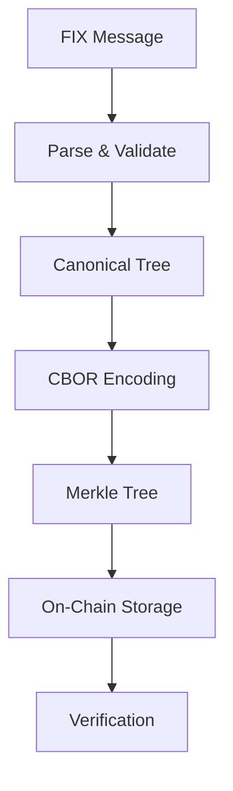

# FixDescriptorKit

> **Transform FIX asset descriptors into verifiable on-chain commitments**

A comprehensive toolkit for converting FIX (Financial Information eXchange) protocol asset descriptors into canonical CBOR payloads and Merkle commitments for blockchain verification.

[](https://opensource.org/licenses/ISC)
[](https://www.typescriptlang.org/)
[](https://nextjs.org/)
[](https://getfoundry.sh/)

## 🚀 Features

- **📋 FIX Message Parsing** - Robust parsing of FIX protocol asset descriptors
- **🔗 Canonical CBOR Encoding** - Deterministic CBOR serialization for consistent hashing
- **🌳 Merkle Tree Generation** - Efficient tree construction with cryptographic proofs
- **⛓️ On-Chain Verification** - Smart contracts for decentralized proof verification
- **🌐 Web Interface** - Interactive UI for testing and deployment
- **🔐 Wallet Integration** - MetaMask support for blockchain interactions

## 📁 Project Structure

```
fixdescriptorkit-evm/
├── packages/
│   └── fixdescriptorkit-typescript/    # Core TypeScript library
├── apps/
│   └── web/                            # Next.js web application
├── contracts/                          # Solidity smart contracts
├── SPEC.md                            # Technical specification
└── DEPLOYMENT.md                      # Deployment guide
```

## 🛠️ Technology Stack

### **Core Library**
- **TypeScript** - Type-safe development
- **fixparser** - FIX protocol message parsing
- **cbor-x** - Canonical CBOR encoding/decoding
- **viem** - Ethereum blockchain interactions
- **vitest** - Fast unit testing

### **Web Application**
- **Next.js 15** - Full-stack React framework
- **App Router** - Modern routing and serverless functions
- **Tailwind CSS** - Utility-first styling
- **MetaMask** - Web3 wallet integration

### **Smart Contracts**
- **Solidity** - Smart contract development
- **Foundry** - Ethereum development framework
- **OpenZeppelin** - Security-audited contract libraries

## 🏃 Quick Start

### Prerequisites

- Node.js 18+ and npm
- [Foundry](https://getfoundry.sh/) for smart contract development
- MetaMask browser extension

### Installation

```bash
# Clone the repository
git clone https://github.com/your-username/fixdescriptorkit-evm.git
cd fixdescriptorkit-evm

# Install dependencies
npm install

# Build the TypeScript library
npm run build

# Start the development server
npm run dev
```

Visit [http://localhost:3000](http://localhost:3000) to see the application.

## 📖 Usage Examples

### TypeScript Library

```typescript
import { 
  parseFixDescriptor, 
  buildCanonicalTree, 
  encodeCanonicalCBOR,
  enumerateLeaves,
  computeRoot,
  generateProof 
} from 'fixdescriptorkit-typescript';

// Parse FIX message
const fixMessage = "8=FIX.4.4|9=0000|35=d|55=ACME|48=US000000AA11|167=CORP|15=USD|10=000";
const tree = parseFixDescriptor(fixMessage);

// Generate canonical CBOR
const canonical = buildCanonicalTree(tree);
const cbor = encodeCanonicalCBOR(canonical);

// Create Merkle commitment
const leaves = enumerateLeaves(canonical);
const root = computeRoot(leaves);

// Generate proof for specific field (e.g., Currency field at path [15])
const proof = generateProof(leaves, [15]);
console.log('Merkle Root:', root);
console.log('Proof:', proof);
```

### Smart Contract Integration

```solidity
import "./FixMerkleVerifier.sol";

contract MyContract {
    using FixMerkleVerifier for bytes32;
    
    function verifyAssetField(
        bytes32 merkleRoot,
        bytes calldata pathCBOR,
        bytes calldata valueCBOR,
        bytes32[] calldata proof,
        bool[] calldata directions
    ) external pure returns (bool) {
        return merkleRoot.verifyField(pathCBOR, valueCBOR, proof, directions);
    }
}
```

## 🧪 Testing

### Run Library Tests
```bash
# Set your FIXParser license key
export FIXPARSER_LICENSE_KEY="your-license-key"

# Run tests
npm test
```

### Run Contract Tests
```bash
cd contracts
forge test
```

## 🚀 Deployment

### Deploy Smart Contracts

```bash
cd contracts

# Deploy to Hoodi testnet
forge script script/DeployFixDescriptorKit.s.sol --rpc-url https://ethereum-hoodi-rpc.publicnode.com --broadcast --verify
```

### Deploy Web Application

See [DEPLOYMENT.md](./DEPLOYMENT.md) for detailed Vercel deployment instructions.

## 🏗️ Architecture

### Data Flow



### Core Components

1. **Parser** - Converts FIX messages to structured trees
2. **Canonicalizer** - Normalizes data for deterministic encoding
3. **CBOR Encoder** - Creates compact binary representations
4. **Merkle Engine** - Generates cryptographic commitments and proofs
5. **Smart Contracts** - Enables on-chain verification

## 📋 API Reference

### Core Functions

#### `parseFixDescriptor(fixRaw: string): DescriptorTree`
Parses a FIX message string into a structured descriptor tree.

#### `buildCanonicalTree(tree: DescriptorTree): CanonicalNode`
Converts a descriptor tree into canonical form for consistent encoding.

#### `encodeCanonicalCBOR(node: CanonicalNode): Uint8Array`
Encodes canonical data into deterministic CBOR format.

#### `computeRoot(leaves: MerkleLeaf[]): string`
Computes the Merkle root hash from enumerated leaves.

#### `generateProof(leaves: MerkleLeaf[], path: number[]): MerkleProof`
Generates a cryptographic proof for a specific field path.

### Smart Contract Functions

#### `verifyField(bytes32 root, bytes pathCBOR, bytes valueCBOR, bytes32[] proof, bool[] directions): bool`
Verifies that a specific field value exists in the Merkle tree.

## 🌐 Networks

### Supported Networks

- **Hoodi Testnet** (Chain ID: 560048)
- **Ethereum Mainnet** (Chain ID: 1)
- **Sepolia Testnet** (Chain ID: 11155111)

### Contract Addresses

| Contract | Hoodi Testnet |
|----------|---------------|
| DataContractFactory | `0x...` |
| DescriptorRegistry | `0x...` |

## 🤝 Contributing

1. Fork the repository
2. Create a feature branch (`git checkout -b feature/amazing-feature`)
3. Commit your changes (`git commit -m 'Add amazing feature'`)
4. Push to the branch (`git push origin feature/amazing-feature`)
5. Open a Pull Request

### Development Guidelines

- Follow TypeScript best practices
- Add tests for new functionality
- Update documentation as needed
- Ensure all tests pass before submitting

## 📄 License

This project is licensed under the ISC License - see the [LICENSE](LICENSE) file for details.

## 🔗 Links

- **Documentation**: [SPEC.md](./SPEC.md)
- **Deployment Guide**: [DEPLOYMENT.md](./DEPLOYMENT.md)
- **Live Demo**: [https://your-app.vercel.app](https://your-app.vercel.app)
- **FIX Protocol**: [https://www.fixtrading.org/](https://www.fixtrading.org/)

## 🙏 Acknowledgments

- [FIX Trading Community](https://www.fixtrading.org/) for the FIX protocol specification
- [OpenZeppelin](https://openzeppelin.com/) for secure smart contract libraries
- [Foundry](https://getfoundry.sh/) for the excellent Ethereum development toolkit

## 📞 Support

For questions, issues, or contributions:

- 📧 Email: [your-email@example.com](mailto:your-email@example.com)
- 🐛 Issues: [GitHub Issues](https://github.com/your-username/fixdescriptorkit-evm/issues)
- 💬 Discussions: [GitHub Discussions](https://github.com/your-username/fixdescriptorkit-evm/discussions)

---

**Built with ❤️ for the financial technology community**
