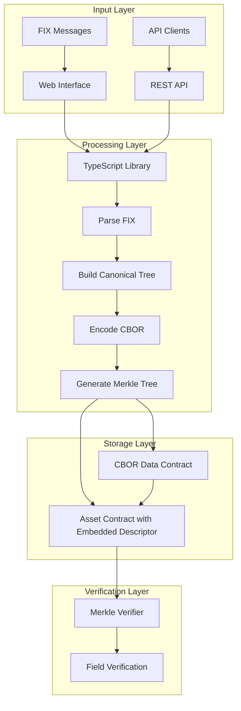
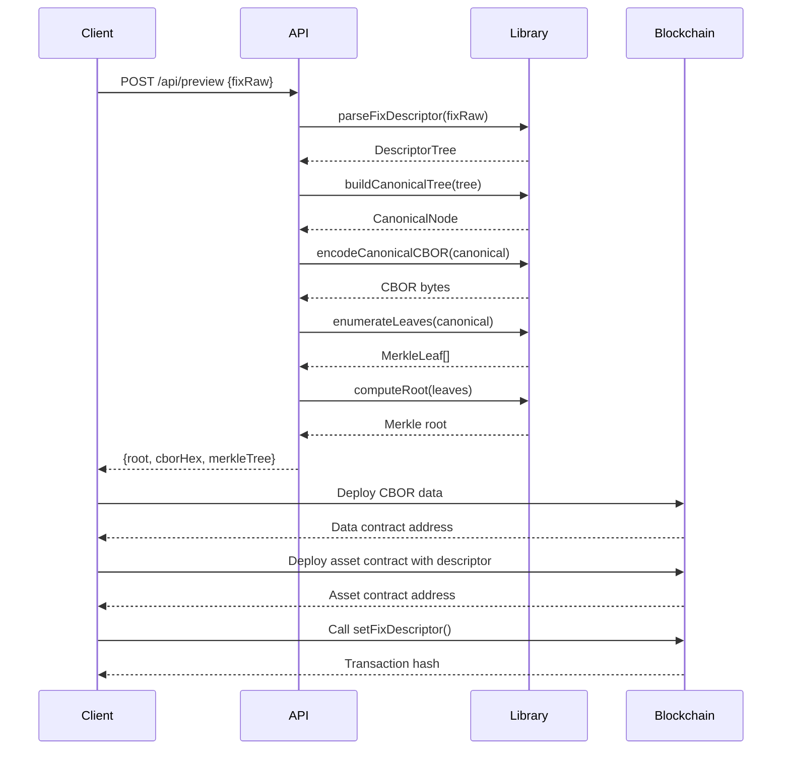
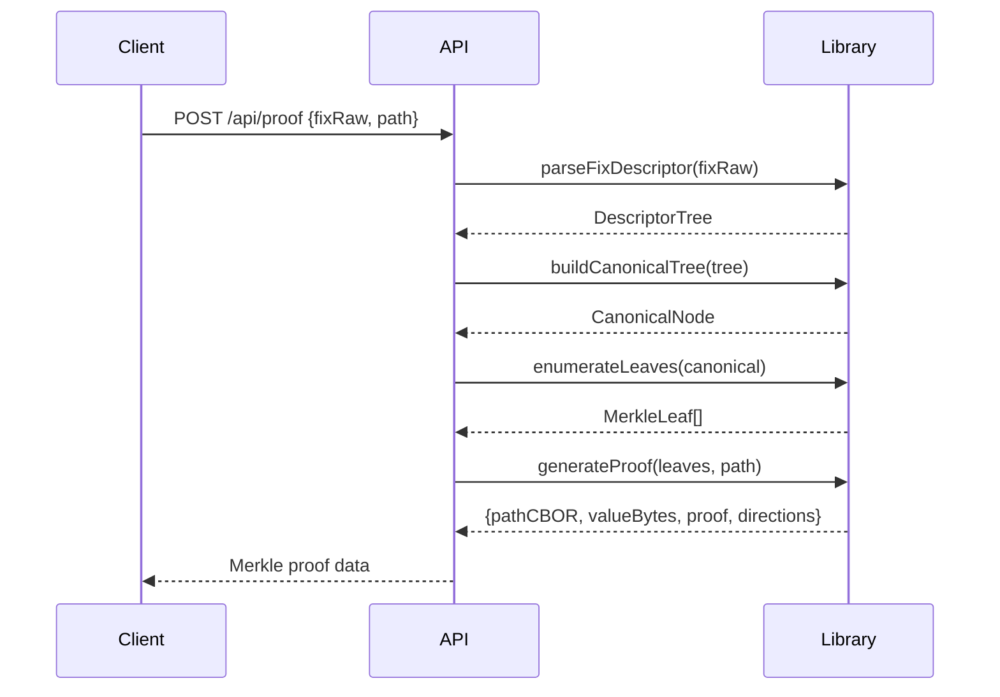
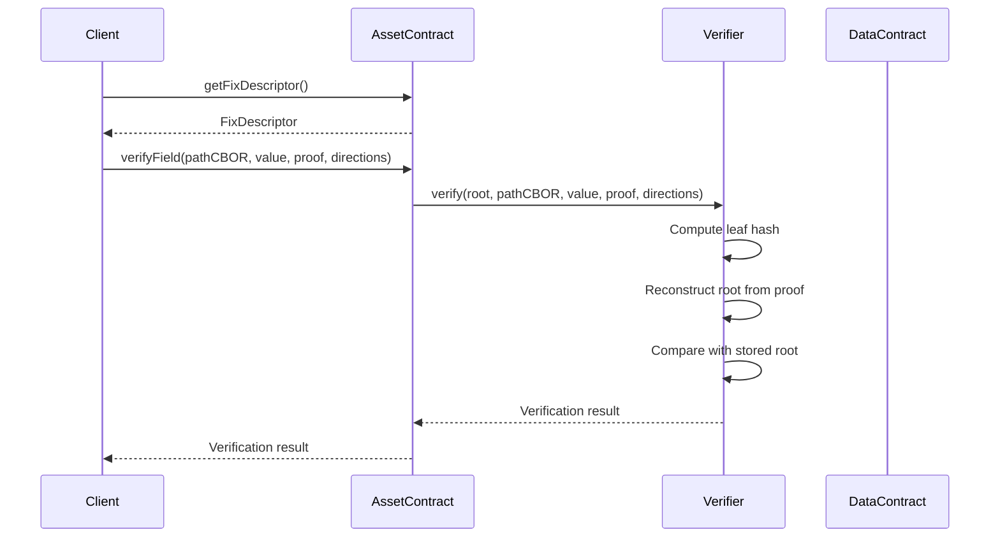
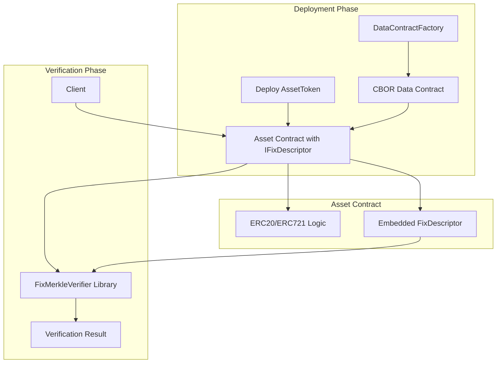
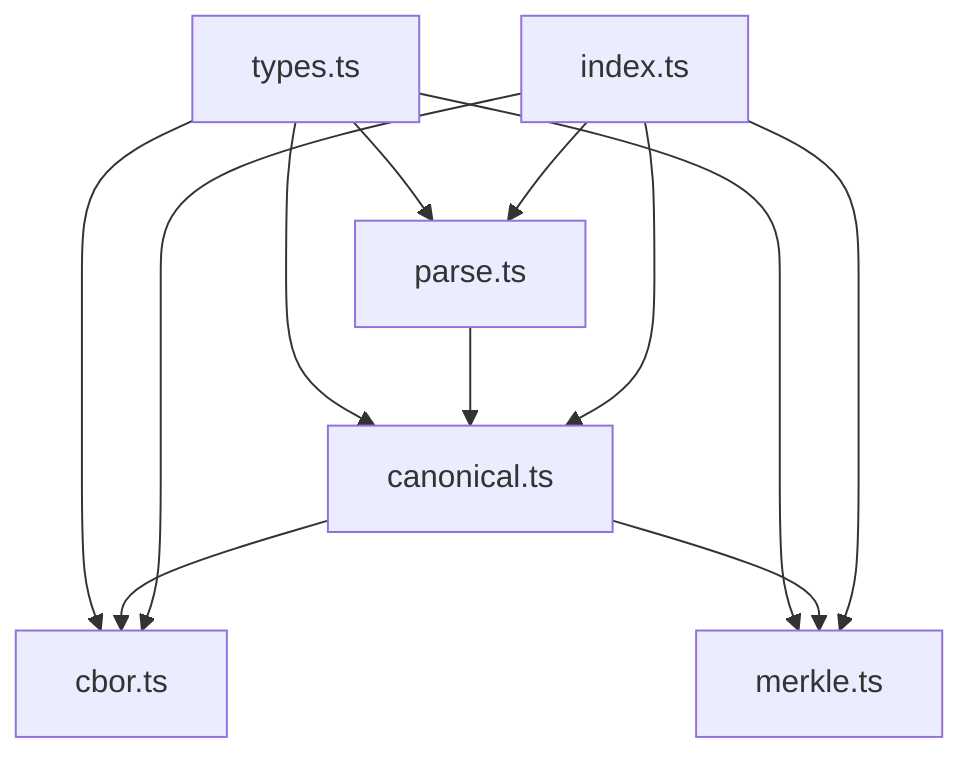
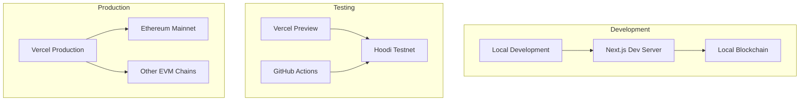

# FixDescriptorKit Architecture

> **Transform FIX asset descriptors into verifiable onchain commitments**

This document provides a comprehensive overview of the FixDescriptorKit architecture, including system design, component interactions, data flow, and deployment strategies.

## Table of Contents

- [Overview](#overview)
- [System Architecture](#system-architecture)
- [Core Components](#core-components)
- [Data Flow](#data-flow)
- [Smart Contract Architecture](#smart-contract-architecture)
- [Web Application Architecture](#web-application-architecture)
- [TypeScript Library](#typescript-library)
- [Deployment Architecture](#deployment-architecture)
- [Security Considerations](#security-considerations)
- [Performance Characteristics](#performance-characteristics)
- [Development Workflow](#development-workflow)

## Overview

FixDescriptorKit is a comprehensive toolkit for converting FIX (Financial Information eXchange) protocol asset descriptors into canonical CBOR payloads and Merkle commitments suitable for blockchain verification. The system enables onchain verification of specific FIX fields without requiring full FIX parsing onchain.

### Key Capabilities

- **FIX Message Parsing**: Robust parsing of FIX protocol messages
- **Canonical CBOR Encoding**: Deterministic binary serialization
- **Merkle Tree Generation**: Cryptographic commitments with proof generation
- **Onchain Verification**: Smart contract-based field verification
- **Web Interface**: Interactive testing and deployment tools
- **Multi-Chain Support**: Ethereum-compatible blockchain deployment

## System Architecture



### Architecture Principles

1. **Separation of Concerns**: Clear boundaries between parsing, encoding, and verification
2. **Deterministic Processing**: Consistent output for identical inputs
3. **Cryptographic Integrity**: Merkle trees ensure data integrity
4. **Gas Efficiency**: Minimal onchain computation
5. **Extensibility**: Modular design for future enhancements

## Core Components

### 1. TypeScript Library (`packages/fixdescriptorkit-typescript/`)

The core processing engine that handles FIX message transformation.

#### Key Modules

- **`parse.ts`**: FIX message parsing and validation
- **`canonical.ts`**: Canonical tree construction
- **`cbor.ts`**: CBOR encoding/decoding
- **`merkle.ts`**: Merkle tree operations and proof generation
- **`types.ts`**: Type definitions and schemas

#### Core Functions

```typescript
// Main processing pipeline
export function encodeAll(rawFix: string, opts?: EncodeAllOptions): CanonicalResult

// Individual components
export function parseFixDescriptor(rawFix: string): DescriptorTree
export function buildCanonicalTree(tree: DescriptorTree): CanonicalNode
export function encodeCanonicalCBOR(node: CanonicalNode): Uint8Array
export function enumerateLeaves(canonical: CanonicalNode): MerkleLeaf[]
export function computeRoot(leaves: MerkleLeaf[]): string
export function generateProof(leaves: MerkleLeaf[], path: Path): MerkleProof
```

### 2. Smart Contracts (`contracts/src/`)

Onchain verification and storage components.

#### Contract Architecture

**Embedded Descriptor Architecture**: FIX descriptors are embedded directly in asset contracts rather than stored in a central registry.

- **`IFixDescriptor.sol`**: Standard interface for asset contracts
- **`AssetTokenERC20.sol`**: Example ERC20 with embedded descriptor
- **`AssetTokenERC721.sol`**: Example ERC721 with embedded descriptor
- **`DataContractFactory.sol`**: SSTORE2-style CBOR data deployment
- **`FixMerkleVerifier.sol`**: Merkle proof verification library

**Benefits:**
- ✅ **Decentralized**: No central registry gatekeeper
- ✅ **Self-Contained**: Each asset is fully self-describing
- ✅ **Implicit Mapping**: Asset address → descriptor relationship is automatic
- ✅ **Issuer Control**: Asset owners maintain full control over descriptors
- ✅ **Standard Compatible**: Works with existing ERC20/ERC721/ERC1155 tokens

#### Key Data Structures

```solidity
struct FixDescriptor {
    uint16  fixMajor;     // FIX version major
    uint16  fixMinor;     // FIX version minor
    bytes32 dictHash;     // FIX dictionary hash
    bytes32 fixRoot;      // Merkle root
    address fixCBORPtr;   // CBOR data contract address
    uint32  fixCBORLen;   // CBOR data length
    string  fixURI;       // Optional mirror URI
}
```

### 3. Web Application (`apps/web/`)

Next.js-based interactive interface for testing and deployment.

#### Application Structure

- **`app/page.tsx`**: Main explorer interface
- **`app/spec/page.tsx`**: Technical specification
- **`app/api/`**: REST API endpoints
- **`lib/abis/`**: Smart contract ABIs
- **`lib/viemClient.ts`**: Blockchain client configuration

#### API Endpoints

- **`/api/preview`**: Process FIX messages and generate commitments
- **`/api/proof`**: Generate Merkle proofs for specific fields
- **`/api/diagnostics`**: System health and configuration

## Data Flow

### 1. FIX Processing Pipeline



### 2. Proof Generation Flow



### 3. Onchain Verification Flow



## Smart Contract Architecture

### Contract Interaction Diagram



### Gas Optimization Strategies

1. **SSTORE2 Pattern**: Efficient CBOR data storage
2. **Library Pattern**: Reusable verification logic
3. **Minimal Onchain Parsing**: No FIX parsing onchain
4. **Batch Operations**: Multiple descriptors in single transaction

### Security Model

- **Decentralized Control**: Each asset owner controls their own descriptor
- **No Central Authority**: No registry gatekeeper or permission model
- **Immutable Data**: CBOR data contracts are immutable
- **Cryptographic Verification**: Merkle proofs ensure integrity
- **Version Control**: Dictionary hash prevents semantic drift
- **ERC165 Discovery**: Standard interface detection for compatibility

## Web Application Architecture

### Component Hierarchy

```
Page (Main Explorer)
├── Header (Navigation)
├── Process Flow (Step indicators)
├── Examples Section
├── Input Section
│   ├── FIX Textarea
│   ├── Field Breakdown
│   └── Action Buttons
├── Results Section
│   ├── Statistics Cards
│   ├── View Mode Tabs
│   │   ├── CBOR Hex View
│   │   ├── Tree Visualization
│   │   └── Merkle Tree View
│   └── Deployment Actions
├── Proof Section
│   ├── Path Selection
│   ├── Proof Generation
│   └── Proof Display
└── How It Works (Educational)
```

### State Management

- **React Hooks**: Local state for UI interactions
- **API Integration**: Server-side processing
- **Wallet Integration**: MetaMask for blockchain interactions
- **Real-time Updates**: Dynamic UI based on processing state

### Responsive Design

- **Mobile-First**: Optimized for mobile devices
- **Progressive Enhancement**: Works without JavaScript
- **Accessibility**: WCAG 2.1 compliance
- **Performance**: Optimized bundle sizes

## TypeScript Library

### Module Dependencies



### Error Handling Strategy

- **Validation Errors**: Input validation with clear messages
- **Processing Errors**: Graceful handling of malformed FIX
- **Type Safety**: TypeScript for compile-time error detection
- **Runtime Checks**: Defensive programming patterns

### Testing Strategy

- **Unit Tests**: Individual function testing
- **Integration Tests**: End-to-end processing
- **Golden Tests**: Reference output validation
- **Spec Compliance**: Standards adherence verification

## Deployment Architecture

### Multi-Environment Support



### Deployment Pipeline

1. **Code Push**: Git push triggers CI/CD
2. **Build Process**: TypeScript compilation and optimization
3. **Testing**: Automated test suite execution
4. **Deployment**: Vercel deployment with environment variables
5. **Contract Deployment**: Foundry scripts for smart contracts
6. **Verification**: Contract verification on block explorers

### Environment Configuration

- **Development**: Local blockchain with test accounts
- **Staging**: Hoodi testnet with test tokens
- **Production**: Mainnet with real assets and gas costs

## Security Considerations

### Cryptographic Security

- **Keccak256 Hashing**: Industry-standard hash function
- **Merkle Tree Integrity**: Tamper-evident data structure
- **Deterministic Encoding**: Consistent CBOR serialization
- **Path Validation**: Secure path traversal

### Smart Contract Security

- **Access Control**: Role-based permissions
- **Reentrancy Protection**: Safe external calls
- **Integer Overflow**: SafeMath patterns
- **Gas Limit Protection**: Bounded operations

### Application Security

- **Input Validation**: Sanitized user inputs
- **XSS Protection**: Content Security Policy
- **CSRF Protection**: SameSite cookies
- **HTTPS Enforcement**: Secure communication

## Performance Characteristics

### Processing Performance

- **FIX Parsing**: O(n) where n = number of fields
- **CBOR Encoding**: O(n) linear with input size
- **Merkle Tree**: O(n log n) for tree construction
- **Proof Generation**: O(log n) for proof size

### Onchain Performance

- **Gas Costs**: ~50k gas for verification
- **Storage Efficiency**: SSTORE2 reduces storage costs
- **Batch Operations**: Multiple verifications in single transaction
- **Caching**: Client-side result caching

### Scalability Considerations

- **Horizontal Scaling**: Stateless API design
- **CDN Distribution**: Global content delivery
- **Database Optimization**: Efficient query patterns
- **Caching Strategy**: Multi-layer caching

## Development Workflow

### Local Development Setup

```bash
# Clone repository
git clone https://github.com/swapnilraj/fix-descriptor.git
cd fix-descriptor

# Install dependencies
npm install

# Start development server
npm run dev

# Run tests
npm test

# Build for production
npm run build
```

### Smart Contract Development

```bash
# Install Foundry
curl -L https://foundry.paradigm.xyz | bash
foundryup

# Compile contracts
forge build

# Run tests
forge test

# Deploy to testnet
forge script script/DeployFixDescriptorKit.s.sol --rpc-url $RPC_URL --broadcast
```

### Contributing Guidelines

1. **Code Style**: ESLint and Prettier configuration
2. **Testing**: Comprehensive test coverage
3. **Documentation**: Inline comments and README updates
4. **Pull Requests**: Clear descriptions and testing
5. **Security**: Security review for smart contracts

---

**Built with ❤️ for the financial technology community**

For more information, see:
- [Technical Specification](./SPEC.md)
- [Deployment Guide](./DEPLOYMENT.md)
- [GitHub Repository](https://github.com/swapnilraj/fix-descriptor)
- [Live Demo](https://fixdescriptor.vercel.app)
